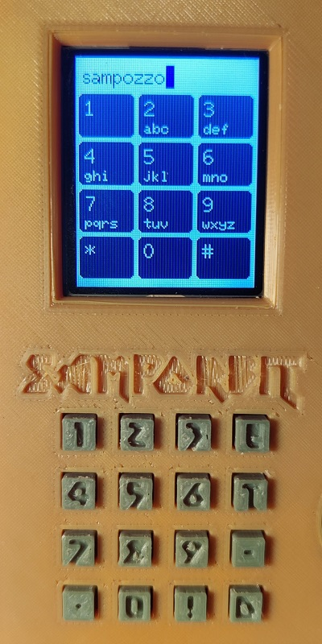

# T9 TFT_eSPI Keypad
### A T9 (predictive text) implementation for esp32 with a tft screen and a 4x4 keypad.

This is a simple funcion that get input from a keypad (like we used to do on old phones before the smartphone's era).

It depends on:
* [Keypad library](https://github.com/Chris--A/Keypad) for input
* [TFT_eSPI library](https://github.com/Bodmer/TFT_eSPI) for screen output

Add t9.h to your code and you can get the String by passing the two objects to the function:

```
// start the t9 loop and get the string from the user input
String result = t9(&tft, &keypad);
```
to write on the T9 keyboard, use 1-0 keys. Use "D" key to move cursor forward, "C" button to move backward, "A" button to exit loop and get the resulting string.

Example is on main.cpp.

## NB: you can find an alternative version using PCF8574 and [I2CKeyPad library](https://github.com/RobTillaart/I2CKeyPad) on the [PCF8574 branch](https://github.com/Sampozzo/t9-tftespi-keypad/tree/PCF8574).



